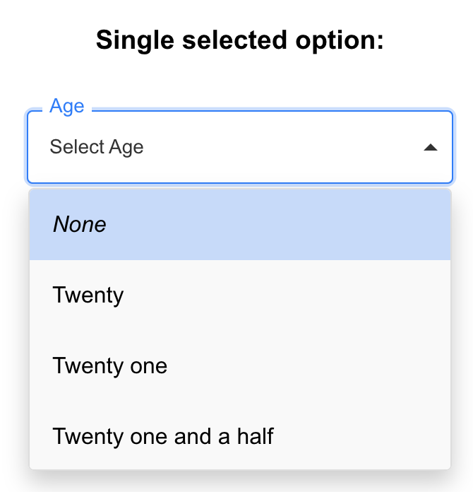
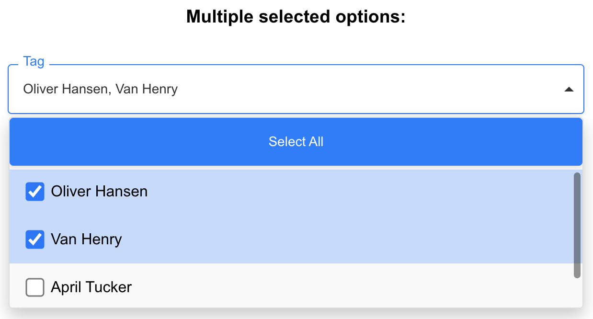

# hive-frontend

This repo demonstrates a custom-built, reusable dropdown menu component developed with React. It showcases both single and multi-select functionalities, designed to be easily integrated into larger applications as part of a component library. The dropdown component supports opening and closing actions, selecting and deselecting options—including a "Select All"/"Deselect All" feature for multi-select mode—and displays selected options when the dropdown is closed.

## Getting Started

These instructions will get you a copy of the project up and running on your local machine for development and testing purposes.

### Prerequisites

Before running this project, you need to have Node.js and npm installed on your machine. Node.js 12.x or newer is recommended. You can download and install Node.js from https://nodejs.org/.

### Installing

1. First, clone the project repository to your local machine using Git:

   ```
   git clone https://github.com/jinhuih/hive-frontend
   ```

2. Navigate into the project directory:

   ```
   cd hive-frontend
   ```

3. Install the project dependencies using npm:

   ```
   npm install
   ```

4. Running the Project:

   ```
   npm start
   ```

## Technology Stack

1. React: Utilizes React hooks such as useState, useEffect, and useRef for state management and lifecycle events.

2. CSS: Custom styles for the dropdown's appearance and responsiveness.

## Project Structure

1. [src/App.js](src/App.js): Contains the main application logic and demonstrates usage of the Dropdown component.

2. [src/components/Dropdown.js](src/components/Dropdown.js): The reusable dropdown component.

3. [src/styles/Dropdown.css](src/styles/Dropdown.css): Styles specific to the dropdown component.

## API
The component should support both single select and multi select:

Single select example:
```
<Dropdown
    title="Age"
    options={["Twenty", "Twenty one", "Twenty one and a half"]}
    multiSelect={false}
    width="300px"
    placeHolder="Select Age"
/>
```


Multi select example:
```
<Dropdown
    title="Tag"
    options={["Oliver Hansen", "Van Henry", "April Tucker", "Ralph Hubbard", "Steve Jobs", "Andy Jassy", "Jeff Bezos"]}
    multiSelect={true}
    width="600px"
    placeHolder="Select name(s)"
/>
```



The component should have a flexible API, making it reusable across different parts of one or more applications:

As above example, you can set the `title`, `options`, `multiSelect`, `width`, and `placeHolder`.

